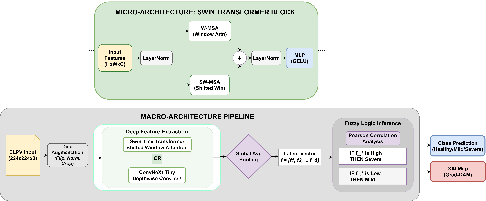
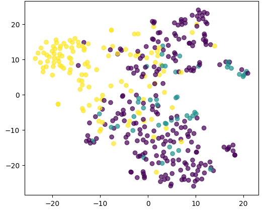
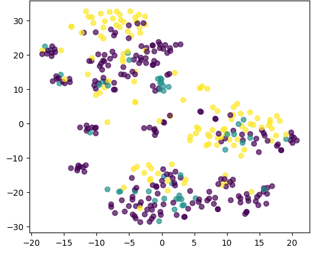
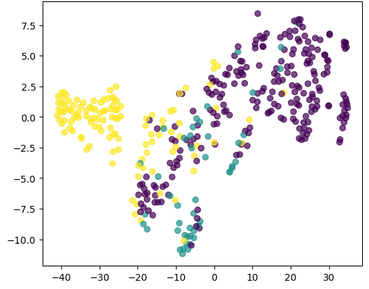
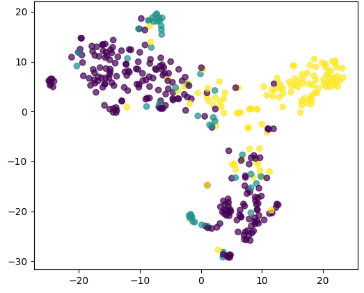
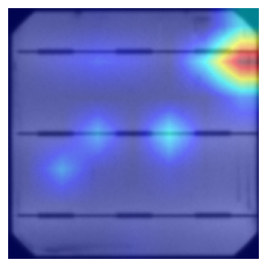
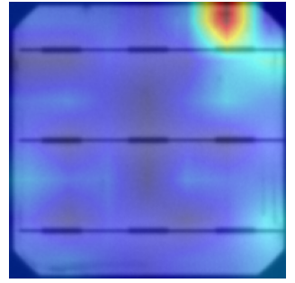

# Interpretable Solar Panel Defect Detection via Fuzzy Rule Extraction from Deep Learning Architectures

<div align="center">

[](https://sasigd.org/)
[](https://python.org)
[](https://pytorch.org)
[](LICENSE)
[](https://www.kaggle.com/datasets/ahmedashrafahmed/elpv-dataset-master)

**Official implementation of our SASIGD 2026 paper**

*Latchan Chhetri\*, Hrishikesh Das, Yogesh Singh*

Sikkim Manipal Institute of Technology, Sikkim Manipal University

\* Corresponding author

</div>

---

## 🔍 Overview

This repository contains the official code for our hybrid **interpretable AI framework** that automatically extracts human-readable **fuzzy logic IF-THEN rules** from trained deep learning models for solar panel defect detection.

Most deep learning approaches for photovoltaic (PV) defect detection are black boxes. Field technicians cannot act on a prediction they cannot understand. Our framework solves this by combining the accuracy of modern vision transformers with the transparency of fuzzy logic, giving operators both a prediction **and** a readable explanation.

### Key Results

| Model | Accuracy | Feature-Severity Correlation | Inference |
|-------|----------|------------------------------|-----------|
| **Swin-Tiny ⭐** | **80.96%** | 0.78 | 22ms |
| ConvNeXt-Tiny | 80.71% | **0.82** | 18ms |
| ViT-Tiny | 79.44% | — | 24ms |
| EfficientNetB0 | 74.62% | 0.42 | 11ms |
| ResNet50 | 73.60% | 0.64 | 15ms |

---

## 🏗️ Framework Architecture



**Top:** Micro-architecture of the Swin Transformer block with W-MSA and SW-MSA attention.

**Bottom:** Full pipeline — ELPV EL image → preprocessing → deep feature extraction → Pearson correlation → fuzzy rule inference → class prediction + Grad-CAM XAI map.

### How It Works

1. **Deep Feature Extraction** — Five architectures (ResNet50, EfficientNetB0, ConvNeXt-Tiny, ViT-Tiny, Swin-Tiny) extract penultimate-layer features from EL images
2. **Fuzzy Rule Extraction** — Pearson correlation identifies the single most severity-discriminative feature dimension; a threshold is optimised on the validation set
3. **Hybrid Inference** — Final prediction combines DL softmax output with fuzzy membership confidence: `ŷ = λ·p(c|x) + (1-λ)·μ_c(g(x))` where λ=0.7

### Extracted Fuzzy Rules (Best Models)

```
ConvNeXt-Tiny:
  IF f487 > -19.18  →  severity is MILD   (μ = 0.82)
  IF f487 < -19.18  →  severity is SEVERE (μ = 0.82)

Swin-Tiny:
  IF f101 < 1.445   →  severity is MILD   (μ = 0.78)
  IF f101 > 1.445   →  severity is SEVERE (μ = 0.78)
```

---

## 📁 Repository Structure

```
Interpretable-Solar-Defect-Detection/
│
├── FINAL_NOTEBOOK.ipynb       # Complete pipeline: training, fuzzy extraction, visualisation
├── architecture.png           # Framework diagram (Fig. 1 in paper)
├── cm_swin.png                # Swin-Tiny confusion matrix
├── attn_swin.png              # Swin-Tiny attention map
├── gradcam_resnet50.png       # ResNet50 Grad-CAM map
├── tsne_resnet50.png          # t-SNE — ResNet50
├── tsne_efficientnet.png      # t-SNE — EfficientNetB0
├── tsne_convnext.png          # t-SNE — ConvNeXt-Tiny
├── tsne_swin.png              # t-SNE — Swin-Tiny
├── LICENSE
└── README.md
```

---

## 🚀 Quick Start

### 1. Clone the repo

```bash
git clone https://github.com/Latchan-Ch/Interpretable-Solar-Defect-Detection.git
cd Interpretable-Solar-Defect-Detection
```

### 2. Install dependencies

```bash
pip install torch torchvision timm scikit-learn matplotlib seaborn numpy pandas jupyter
```

### 3. Download the ELPV dataset

Download from [Kaggle](https://www.kaggle.com/datasets/ahmedashrafahmed/elpv-dataset-master) and place in your working directory.

### 4. Run the notebook

```bash
jupyter notebook FINAL_NOTEBOOK.ipynb
```

The notebook covers end-to-end:
- Data loading and preprocessing
- Training all five architectures
- Fuzzy rule extraction via Pearson correlation
- t-SNE feature space visualisation
- Grad-CAM / attention map generation
- Hybrid inference evaluation

---

## 📊 Visualisations

### t-SNE Feature Space Comparison

| ResNet50 | EfficientNetB0 | ConvNeXt-Tiny | Swin-Tiny |
|----------|----------------|---------------|-----------|
|  |  |  |  |

*Yellow: No Defect — Purple: Severe Defect — Cyan: Mild Defect*

ConvNeXt-Tiny and Swin-Tiny produce clearly separated clusters, directly validating their higher fuzzy rule correlation scores.

### Explainability Maps

| ResNet50 Grad-CAM | Swin-Tiny Attention |
|-------------------|---------------------|
|  |  |

ResNet50 fixates on narrow crack edges. Swin-Tiny attends to both defect regions and the surrounding cell grid, enabling more robust mild-defect reasoning.

---

## 📋 Dataset

We use the **ELPV (Electroluminescence Photovoltaic)** benchmark dataset.

- **2,624** grayscale EL images of solar cells (300×300 px)
- Labels mapped to 3 severity classes: No Defect / Mild / Severe
- Split: 70% train / 15% validation / 15% test (stratified)

| Class | Samples | Percentage |
|-------|---------|------------|
| No Defect | 1,510 | 57.5% |
| Mild Defect | 299 | 11.4% |
| Severe Defect | 815 | 31.2% |

Download: [Kaggle ELPV Dataset](https://www.kaggle.com/datasets/ahmedashrafahmed/elpv-dataset-master)

---

## ⚙️ Training Details

| Setting | Value |
|---------|-------|
| Framework | PyTorch |
| GPU | NVIDIA T4 |
| Input size | 224 × 224 |
| Optimizer | Adam (lr=1e-4, wd=1e-5) |
| Augmentation | Flip, Rotate ±15°, Brightness ±20% |
| Class imbalance | Weighted random sampling |
| Seeds | 3 independent runs |

---

## 📄 Citation

If you use this code or find this work helpful, please cite:

```bibtex
@inproceedings{chhetri2026interpretable,
  title     = {Interpretable Solar Panel Defect Detection via Fuzzy Rule 
               Extraction from Deep Learning Architectures},
  author    = {Chhetri, Latchan and Das, Hrishikesh and Singh, Yogesh},
  booktitle = {2026 International Conference on Sustainable AI for Social 
               Impact and Global Development (SASIGD)},
  year      = {2026},
  publisher = {IEEE}
}
```

---

## 🔗 Related Links

- 📄 **Conference:** [SASIGD 2026](https://sasigd.org/)
- 📦 **Dataset:** [ELPV on Kaggle](https://www.kaggle.com/datasets/ahmedashrafahmed/elpv-dataset-master)
- 🏛️ **Institution:** [SMIT, Sikkim Manipal University](https://smit.smu.edu.in/)

---

## 📬 Contact

**Latchan Chhetri** *(Corresponding Author)*
Dept. of Artificial Intelligence and Data Science
Sikkim Manipal Institute of Technology
📧 latchanchhetri19@gmail.com

---

<div align="center">

⭐ If this work helped you, please consider starring the repo!

</div>
